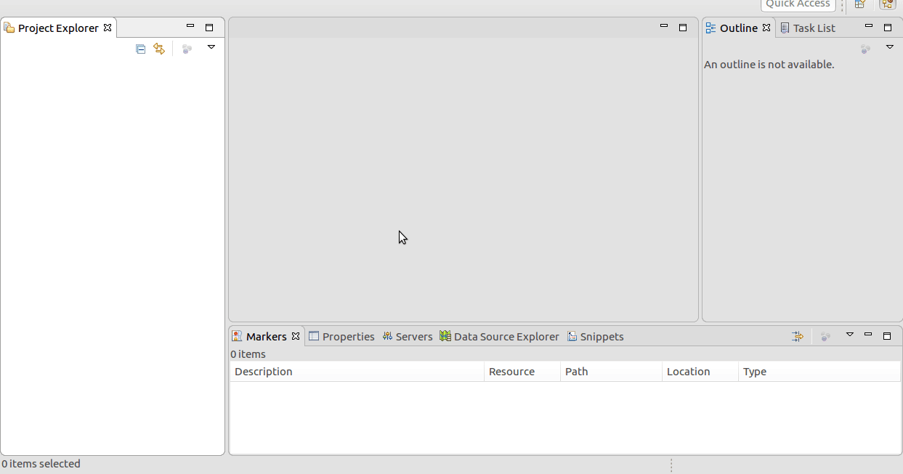
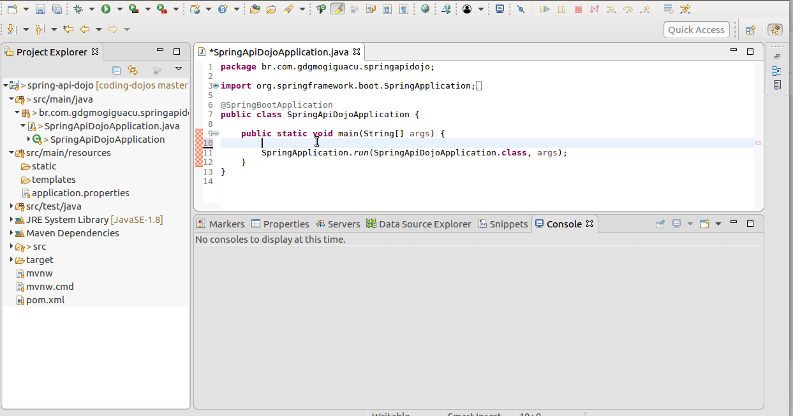

# Writing Rest APIs w/ Spring Framework from scratch

## What you need to install in your machine
1. Java Development Kit 1.8+ (JDK) - http://www.oracle.com/technetwork/pt/java/javase/downloads/jdk8-downloads-2133151.html
2. Maven - https://maven.apache.org/install.html
3. Eclipse EE (you also can use intelliJ, vscode, netbeans...) - https://www.eclipse.org/downloads/packages/

## Importing the project using Eclipse

## Running the project using Eclipse

